# 树莓派Zero烧写系统镜像全过程


仓库：[HuangCheng72/raspberrypizero: 存放关于我的树莓派zero的相关资源 (github.com)](https://github.com/HuangCheng72/raspberrypizero)

本文主要是趁自己还记得具体操作的时候记下来，怕就怕下次真正需要用上树莓派的时候忘了。

设备型号：raspberrypi zero

设备扩展资源：ZERO USB PLUG（USB、SSH、LAN、HID、MIDI，五合一扩展板）

设备来源：海鲜市场买的二手

TF卡：爱国者T1 32G（2020年淘宝买的全新）

设备图片：

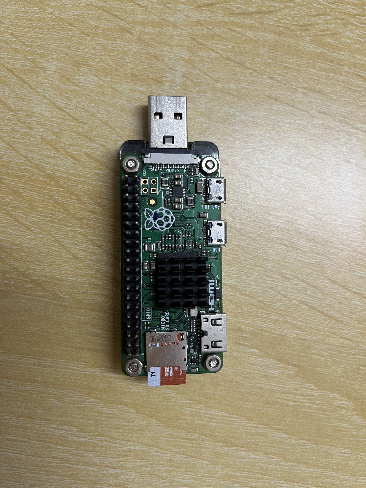

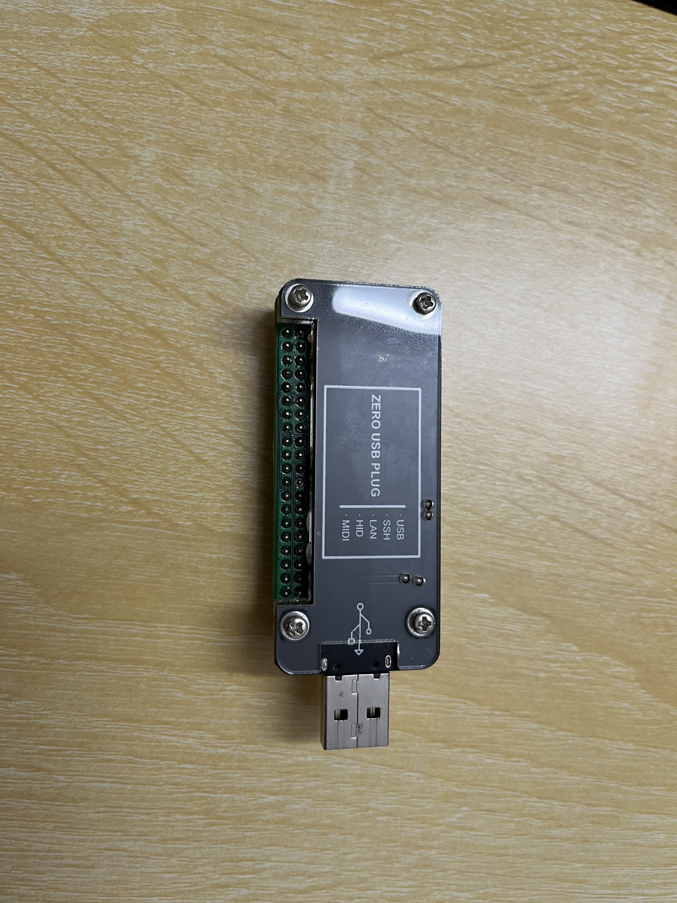


## 1. 官网下载烧写软件

当时刚买的时候，树莓派官方只给img镜像，烧写还得用一堆软件，烧写完了还要用虚拟机（Windows无法识别ext4文件系统）改根文件系统里面的配置（不然直接连不上）。现在官网出了烧写软件，从下载镜像到烧写全部一键搞定，舒服多了。

下载地址：https://downloads.raspberrypi.org/imager/imager_latest.exe

下载安装，一律默认就行了，反正这软件也没什么能改配置的地方。

TF卡上读卡器，插上USB口。

进入软件界面，选择设备，烧写的系统，烧写到的TF卡。

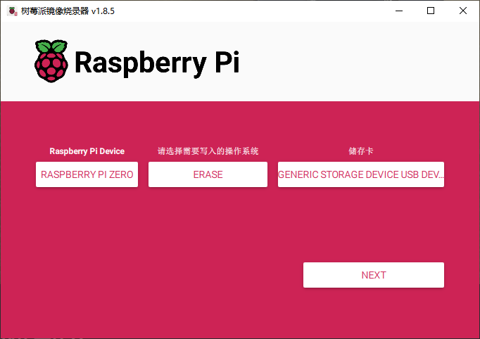

以防万一，一律建议先擦除（ERASE），再烧写。

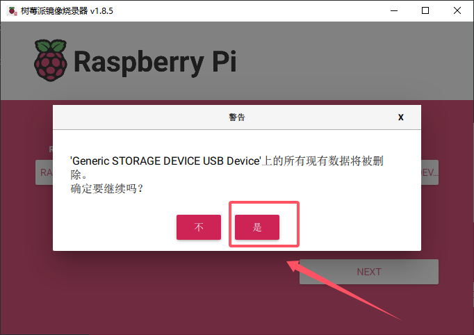

注意，这软件操作逻辑不太一样，它的YES都是放在右边的，习惯YES在左边的很容易点错。

会弹出提示，可以看到这是机翻的中文，但是不影响操作，要拔掉读卡器再插，才能进行下一步。

然后操作系统那边选一个适合设备的操作系统镜像就行了。

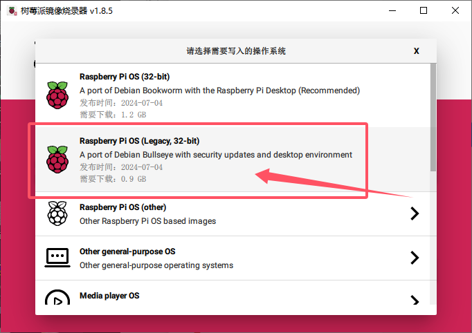

第二个比较小，如果觉得自己机器资源不够，建议第二个，我自己的成功经验仅限于第二个，第一个我也不知道有什么问题。

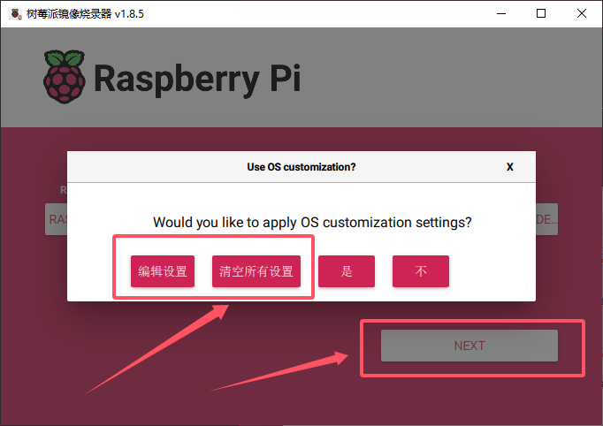

先 NEXT ，弹出用户设置对话框，先清空所有设置，再编辑设置。

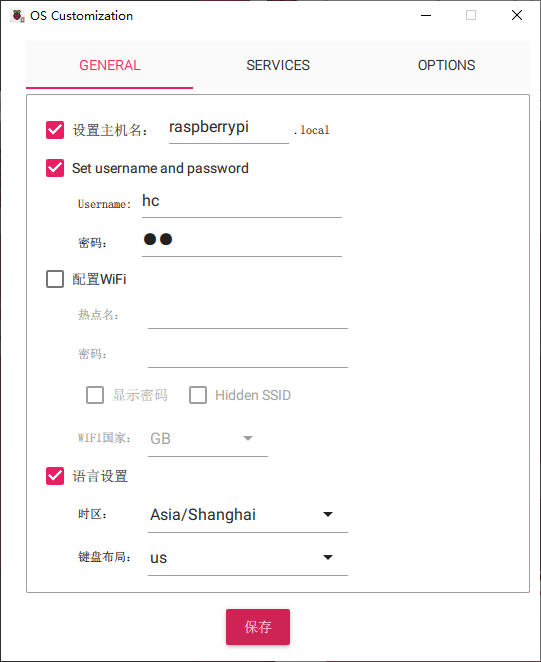

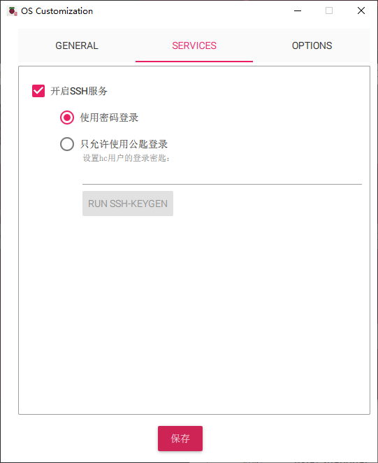

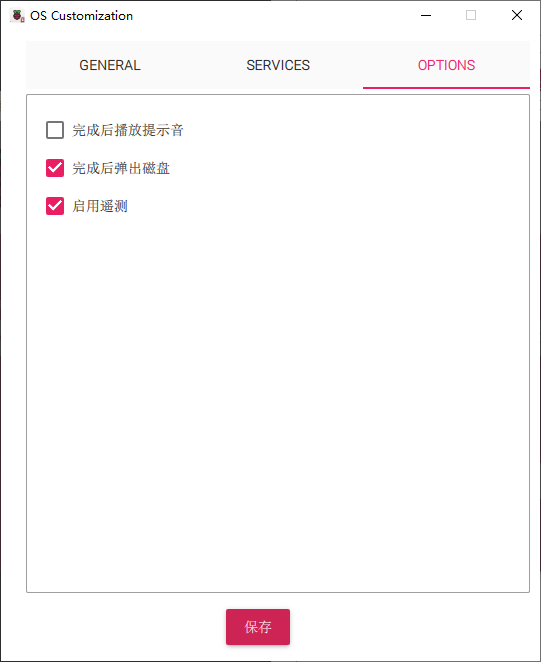

这里把所有的配置都记下来。点击保存就行。然后点是，应用该配置。继续即可。

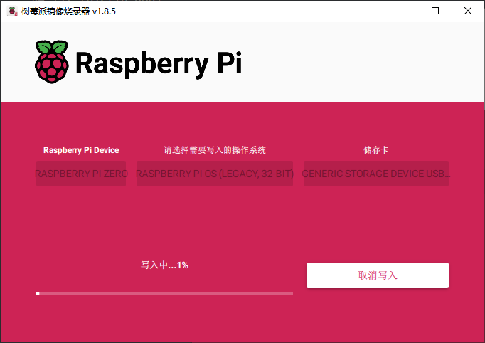

等待它写入、验证完成，弹出机翻中文的提示框，就OK了。

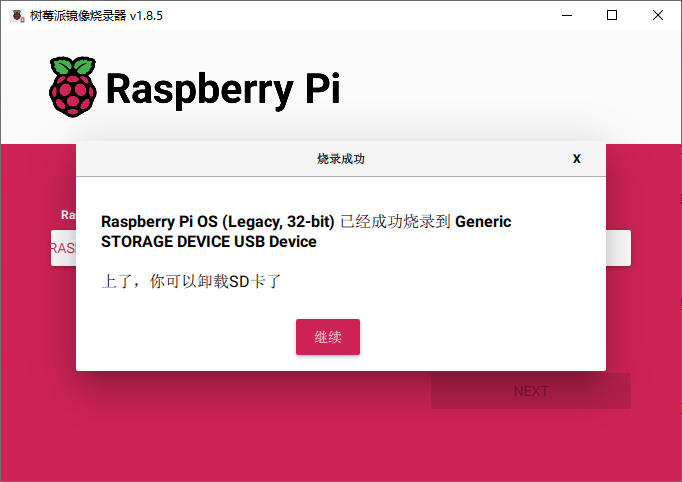

## 2. 更改启动配置

弹出TF卡再插。Windows系统能识别到的那个FAT32格式的分区 `bootfs`。

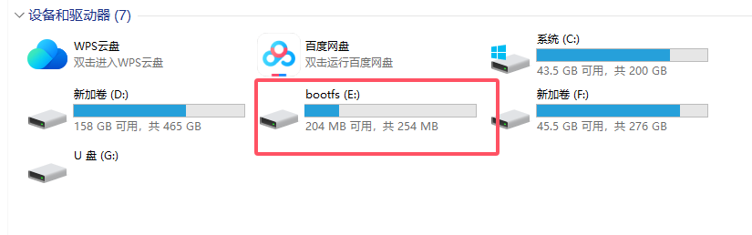

找里面的 `config.txt` 和 `cmdline.txt` 。

### 2.1 cmdline.txt

```
console=serial0,115200 console=tty1 root=PARTUUID=c5d61508-02 rootfstype=ext4 fsck.repair=yes rootwait quiet init=/usr/lib/raspberrypi-sys-mods/firstboot splash plymouth.ignore-serial-consoles systemd.run=/boot/firstrun.sh systemd.run_success_action=reboot systemd.unit=kernel-command-line.target
```

这东西是一整行的，修改的时候也不要搞出多余的行，这东西就是 u-boot 里面说的传给内核的bootargs（启动参数）。

在

```
rootwait quiet
```

这两个之间，插入一句：

```
modules-load=dwc2,g_ether
```

也就是

```
rootwait modules-load=dwc2,g_ether quiet
```

总的就是：

```
console=serial0,115200 console=tty1 root=PARTUUID=c5d61508-02 rootfstype=ext4 fsck.repair=yes rootwait modules-load=dwc2,g_ether quiet init=/usr/lib/raspberrypi-sys-mods/firstboot splash plymouth.ignore-serial-consoles systemd.run=/boot/firstrun.sh systemd.run_success_action=reboot systemd.unit=kernel-command-line.target
```


### 2.2 config.txt

```
# For more options and information see
# http://rpf.io/configtxt
# Some settings may impact device functionality. See link above for details

# uncomment if you get no picture on HDMI for a default "safe" mode
#hdmi_safe=1

# uncomment the following to adjust overscan. Use positive numbers if console
# goes off screen, and negative if there is too much border
#overscan_left=16
#overscan_right=16
#overscan_top=16
#overscan_bottom=16

# uncomment to force a console size. By default it will be display's size minus
# overscan.
#framebuffer_width=1280
#framebuffer_height=720

# uncomment if hdmi display is not detected and composite is being output
#hdmi_force_hotplug=1

# uncomment to force a specific HDMI mode (this will force VGA)
#hdmi_group=1
#hdmi_mode=1

# uncomment to force a HDMI mode rather than DVI. This can make audio work in
# DMT (computer monitor) modes
#hdmi_drive=2

# uncomment to increase signal to HDMI, if you have interference, blanking, or
# no display
#config_hdmi_boost=4

# uncomment for composite PAL
#sdtv_mode=2

#uncomment to overclock the arm. 700 MHz is the default.
#arm_freq=800

# Uncomment some or all of these to enable the optional hardware interfaces
#dtparam=i2c_arm=on
#dtparam=i2s=on
#dtparam=spi=on

# Uncomment this to enable infrared communication.
#dtoverlay=gpio-ir,gpio_pin=17
#dtoverlay=gpio-ir-tx,gpio_pin=18

# Additional overlays and parameters are documented /boot/overlays/README

# Enable audio (loads snd_bcm2835)
dtparam=audio=on

# Automatically load overlays for detected cameras
camera_auto_detect=1

# Automatically load overlays for detected DSI displays
display_auto_detect=1

# Enable DRM VC4 V3D driver
dtoverlay=vc4-kms-v3d
max_framebuffers=2

# Disable compensation for displays with overscan
disable_overscan=1

[cm4]
# Enable host mode on the 2711 built-in XHCI USB controller.
# This line should be removed if the legacy DWC2 controller is required
# (e.g. for USB device mode) or if USB support is not required.
otg_mode=1

[all]

[pi4]
# Run as fast as firmware / board allows
arm_boost=1

[all]

```

主要找：

```
dtoverlay=dwc2
```

如果没有这句就在最后加上，如果有的话就不额外加了。

这里是在最后加上：

```c
[all]
dtoverlay=dwc2

```

注意最后一定要有一个空行。

### 2.3 修改目的

其实就是为了用USB转网卡再转SSH。为什么要用这个？

因为现在树莓派的Linux系统，把SSH支持删掉了。可以进入系统下载回来。

可是和系统交互，需要SSH。

所以没办法了，逻辑上就死循环了，只能用USB转网卡再转SSH解决这个问题。

这么做还有一个好处，就是树莓派可以通过这个方式上网了。


## 3. 安装USB转网卡驱动

这是Windows下的驱动，压缩包我放自己的仓库了。

[mod-duo-rndis.zip](https://github.com/HuangCheng72/raspberrypizero/blob/main/Documents/mod-duo-rndis.zip)

TF卡上树莓派，树莓派上电脑USB口。

等待一段时间（我也不知道为什么要等这么久，我等了三分钟这样），就能被Windows识别出串口设备了。

开设备管理器。

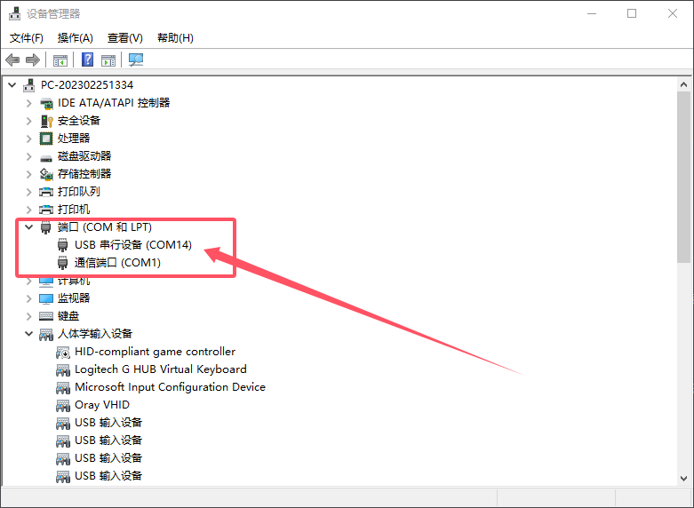

给这个COM14的USB串行设备安装新驱动。右键，选中 `更新驱动设备` 。

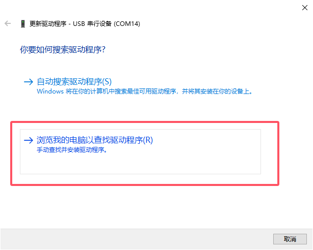

然后选中我们的设备驱动所在的文件夹（需要先解压出来）。

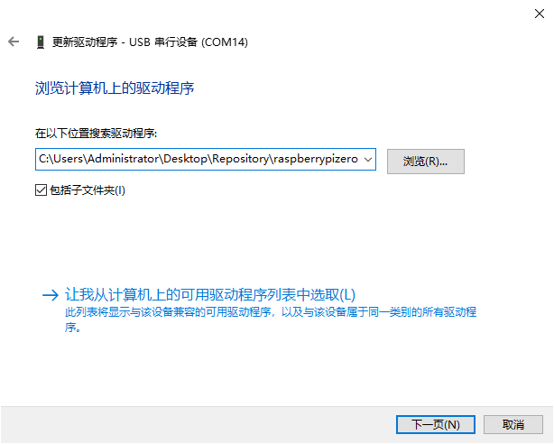

下一页即可。

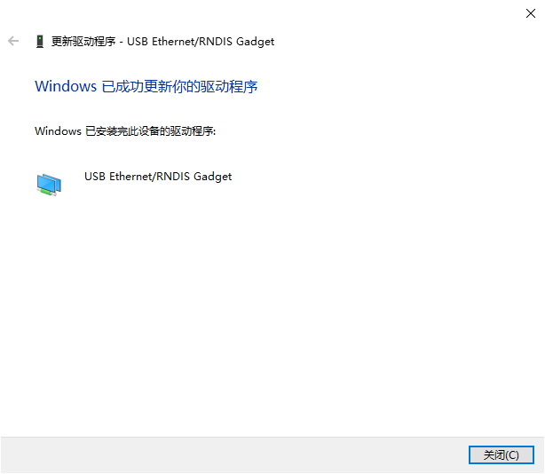

安装USB转网卡驱动之后，就可以用之前刷入树莓派系统的配置来访问树莓派了。

XShell配置：

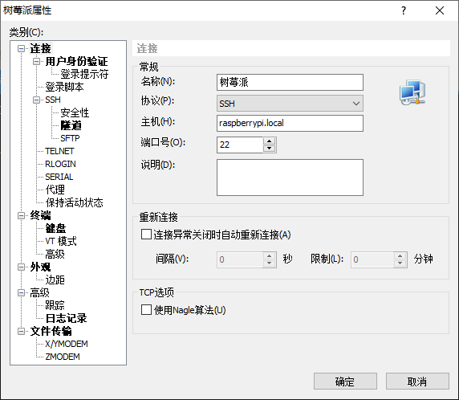

过了身份验证就行了。

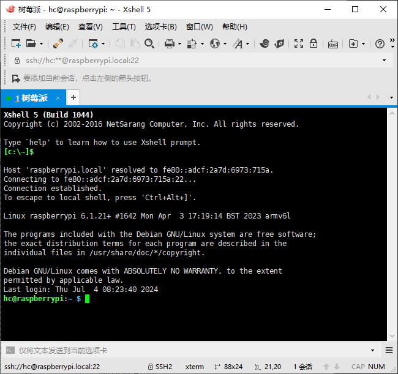

上网也简单，直接在 ` 控制面板 -> 网络和Internet -> 网络连接 ` 这里共享就行了。

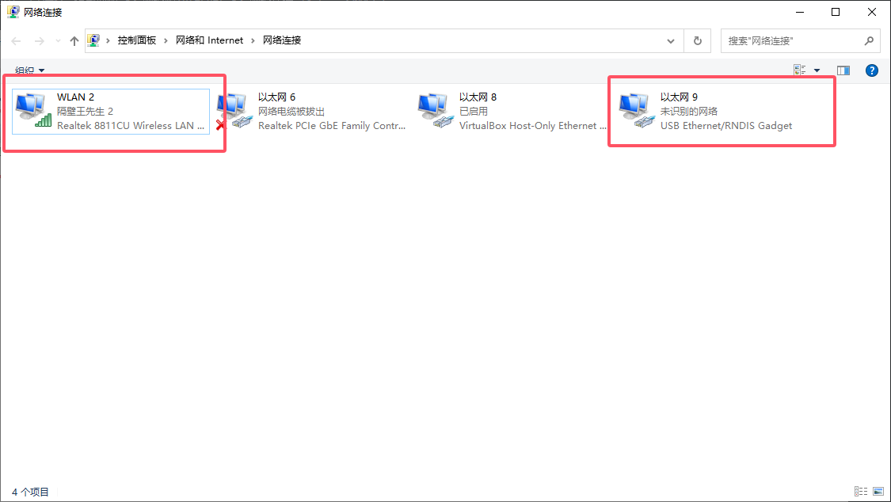

WLAN2是我上网的网卡，以太网9就是树莓派的USB转换的网卡，所以在WLAN2这里共享。


确定即可。

XShell里面断开树莓派重连。

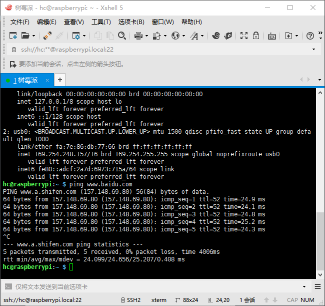

用 `ip a` 和 `ping` 都能确认网络通了。

最后ubuntu系统老规矩：

```bash
sudo apt update

```

一切完工。